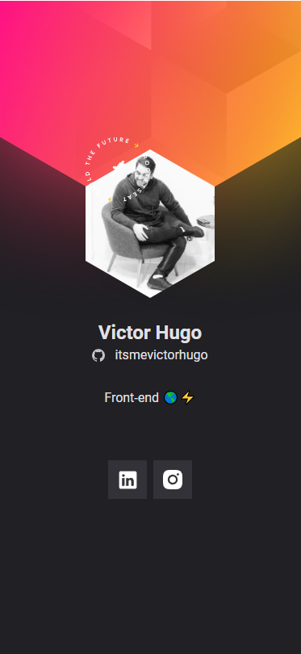

<p align="center">
  
</p>

<p align="center">
  

     
</p>

<br>

## 🧪 Tecnologias

Esse projeto foi desenvolvido com as seguintes tecnologias:

- [HTML](https://developer.mozilla.org/pt-BR/docs/Web/HTML)
- [CSS](https://developer.mozilla.org/pt-BR/docs/Web/CSS)
- [Javascript](https://developer.mozilla.org/pt-BR/docs/Web/JavaScript)

## 🚀 Como clonar

Clone o projeto e acesse a pasta do mesmo.

```bash
$ git clone https://github.com/itsmevictorhugo/badge-dowhile2021.git
$ cd badge-dowhile2021
```

## 💻 Projeto

Badge DoWhile2021 é um crachá virtual que consome dados da API do github e preencher as informações.

Este é um projeto desenvolvido durante a **[Next Level Week Heat](https://nextlevelweek.com/)**, apresentada dos dias 18 a 24 de Outubro de 2021.

## 🔖 Layout

Você pode visualizar o layout do projeto através do link abaixo:

- [Layout](<https://www.figma.com/file/FdI8gL6lumZJlas7Nr7wkv/%5BNLW-Heat---Mission%3A-Origin%5D-DoWhile2021-(Community)?node-id=0%3A1>)

Lembrando que você precisa ter uma conta no [Figma](http://figma.com/).

## 📝 License

Esse projeto está sob a licença MIT. Veja o arquivo [LICENSE](LICENSE.md) para mais detalhes.
